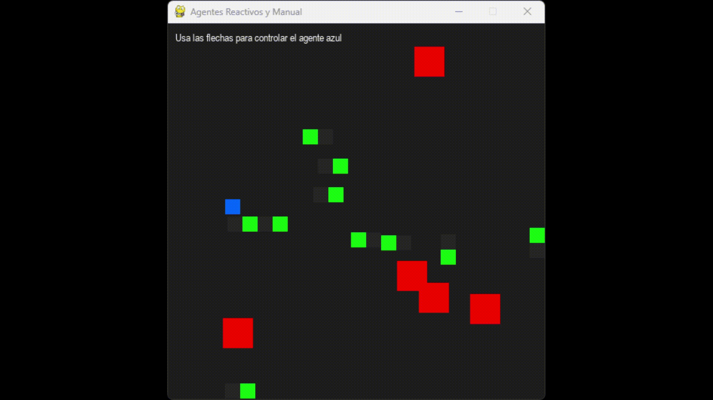
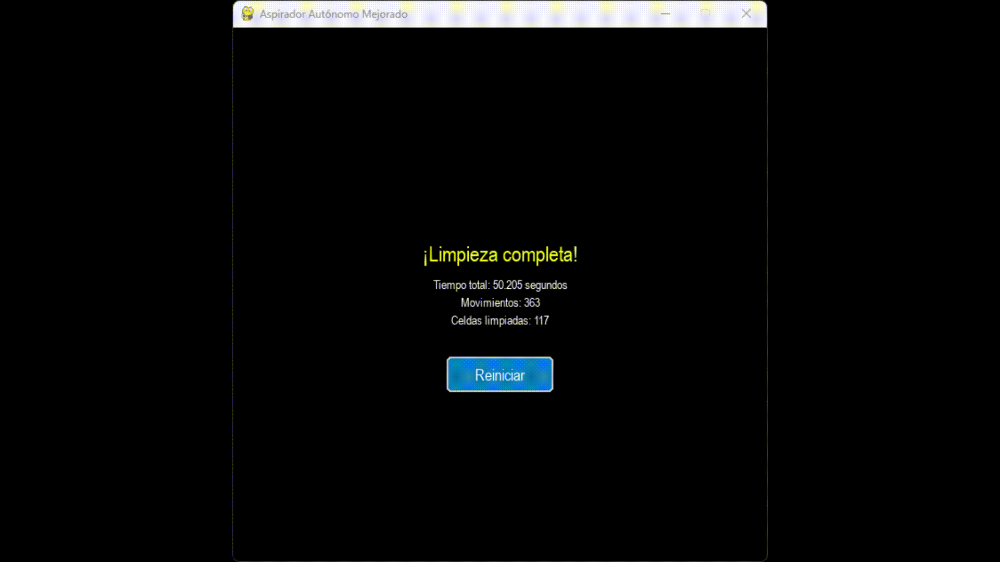

# Simuladores de Agentes Inteligentes

Este repositorio contiene implementaciones de diferentes tipos de agentes inteligentes para fines educativos. A continuación se describen los simuladores disponibles.

## 1. Agentes Reactivos



### Descripción
El programa `agente_reactivo.py` implementa una simulación de agentes reactivos que navegan en un entorno con obstáculos. Demuestra el comportamiento basado en estímulos-respuesta característico de los agentes reactivos.

### Características
- **Agentes Reactivos** (verde): Se mueven automáticamente evitando obstáculos y otros agentes
- **Agente Manual** (azul): Controlado por el usuario mediante las teclas de dirección
- **Campo de Visión**: Los agentes pueden "ver" obstáculos cercanos y reaccionar antes de colisionar
- **Comportamiento Emergente**: Los agentes tienden a agruparse y moverse de forma similar a enjambres

### Cómo Funciona
Los agentes reactivos utilizan una heurística de cambio de dirección que:
1. Detecta colisiones inminentes en su campo de visión
2. Intenta dirigirse hacia el centro de la pantalla cuando es posible
3. Evita repetir la dirección que causó una colisión anterior
4. Elige aleatoriamente entre las direcciones disponibles cuando es necesario

### Controles
- **Flechas de dirección**: Controlan el movimiento del agente azul (manual)
- **Cierre de ventana**: Finaliza la simulación

## 2. Aspiradoras Autónomas



### Descripción
El programa `agente_autonomo.py` simula aspiradoras autónomas que limpian un entorno de cuadrícula. Demuestra agentes reactivos con un objetivo específico (limpiar todas las celdas sucias).

### Características
- **Múltiples Aspiradoras**: Varias aspiradoras trabajan simultáneamente para limpiar el entorno
- **Ambiente Discreto**: Cuadrícula con celdas limpias (blancas) y sucias (marrones)
- **Búsqueda Inteligente**: Las aspiradoras buscan primero celdas sucias cercanas
- **Prevención de Colisiones**: Los agentes evitan colisionar entre sí
- **Estadísticas en Tiempo Real**: Muestra tiempo, movimientos y progreso de limpieza
- **Resumen Final**: Al terminar, muestra estadísticas de rendimiento

### Cómo Funciona
Las aspiradoras siguen este algoritmo:
1. Si la celda actual está sucia, la limpian
2. Buscan celdas sucias en su vecindad
3. Se mueven hacia la celda sucia más cercana
4. Si no hay celdas sucias cercanas, se mueven aleatoriamente evitando colisiones
5. La simulación termina cuando todas las celdas están limpias

### Controles
- **+/-**: Aumenta/disminuye la velocidad de la simulación
- **Botón de Reinicio**: Aparece al finalizar para iniciar una nueva simulación
- **Cierre de ventana**: Finaliza la simulación

## Requisitos
- Python 3.x
- Pygame (`pip install pygame`)

## Ejecución
Para ejecutar cualquiera de los simuladores:

```bash
# Para ejecutar el simulador de agentes reactivos
python agente_reactivo.py

# Para ejecutar el simulador de aspiradoras autónomas
python agente_autonomo.py
```

---

Ambos simuladores proporcionan una visualización interactiva de diferentes tipos de agentes inteligentes y sus comportamientos, ideales para comprender los fundamentos de la inteligencia artificial reactiva.